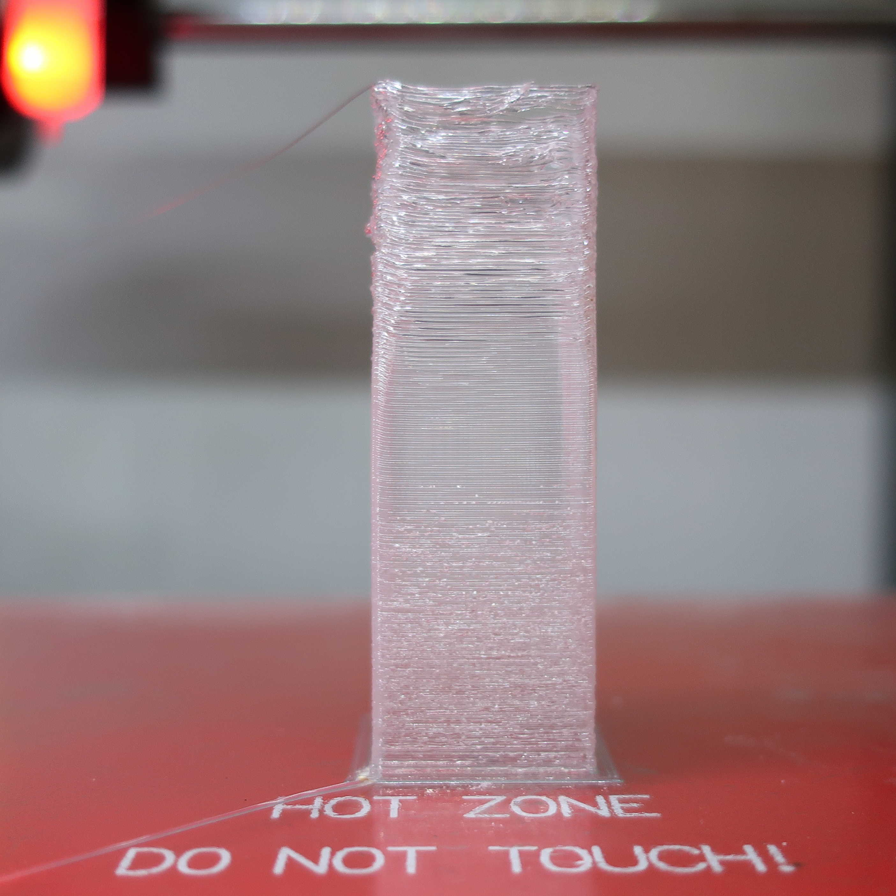

# TemperatureTowerABS

The config.txt and pattern.txt files in this folder can be used as input files on TestPrint.exe to generate a "temperature tower" object suitable to find optimal 3D printing temperature for ABS and some other materials.

The picture above is from a temperature tower made from transparent TPU on an AGraber 30i printer. The print started at 260 °C and finished at 200 °C. No cooling fan was used. The object is 60 mm high. The best results were obtained between 25 mm and 35 mm height. This indicates that, with this material and in this conditions, the optimum temperature is about 230 °C.

The same test could be run, for example, at various fan speeds to see the influence of the cooling fan on layer adhesion, overall finishing, precision, etc.

